# Schelling's Model

Progetto per l'esame di **Programmazione Concorrente e Parallela su Cloud**.

- Studente: **Tesauro Emmanuel**
- Matricola: **0522500988**
- MD5: **4bc390e61c1cd2a4001199d94b8d334d**
- Amazon EC2 instance types: **t2.2xlarge**

## Summary

[- Introduction](#Introduction): breve introduzione al problema\
[- Parallel Solution Description](#Parallel-Solution-Description): analisi della soluzione adottata\
[- Project structure](#Project-structure): come è organizzato il progetto\
[- Execution instructions](#Execution-instructions): cosa fare per eseguire il programma\
[- Implementation details](#Implementation-details): analisi dettagliata del codice\
[- Correctness discussion](#Correctness-discussion): discussione circa la correttezza\
[- Benchmarks](#Benchmarks): benchmarks finali

## Introduction

Il modello di segregazione di Schelling è un modello agent-based che dimostra che avere persone con una preferenza "lieve" all'interno del proprio gruppo nei confronti nel gruppo stesso, porta inevitabilmente ad una società segregata.


L'obiettivo di tale progetto è quello di implementare il modello di segregazione di Schelling creando un programma scritto in linguaggio C ed utilizzando la libreria Open MPI.

Viene fornito un unico file (Schelling.c) che necessita di essere prima compilato e, poi, eseguito.\
Al suo interno è possibile definire la grandezza della matrice di partenza a proprio piacimento, in quanto l'algoritmo lavora con matrici di qualsiasi dimensione.

## Parallel Solution Description

La soluzione sviluppata segue 8 passi ben definiti.

1. Il Master inizializza la matrice utilizzando le costanti definite all'interno del programma. Di default, questi valori sono:

   - Numero di righe: **100**
   - Numero di colonne: **100**
   - Percentuale di agenti '**X**' all'interno della matrice: **30%**
   - Percentuale di agenti '**O**' all'interno della matrice: **30%**
   - Percentuale di soddisfazione degli agenti: **33.3%**

2. Suddivisione della matrice per numero di righe tra i vari processi
3. Scambio delle righe tra i processi adiacenti per il calcolo della soddisfazione (locale) degli agenti della sottomatrice (la prima riga con il processo precedente e l'ultima riga con il processo successivo).
4. Calcolo della soddisfazione di ogni agente della sottomatrice
5. Calcolo del numero di celle vuote di ogni sottomatrice e delle posizioni in cui sono situate
6. Scambio delle posizioni calcolate al punto precedente tra tutti i processi per l'assegnazione delle celle di destinazione in cui gli agenti possono spostarsi
7. Spostamento degli agenti
8. Recupero della matrice finale per calcolare la soddisfazione globale

> Nota: I punti **3-7** vengono ripetuti per un numero di volte pari **MAX_STEP**.

## Project structure

- src/
  - _**Schelling_MPI.c**_: file contenente il codice sorgente del programma
- files_out/
  - _**Schelling_MPI.out**_: file eseguibile del programma
  - _**Schelling_MPI.html**_: file generato al termine dell'esecuzione del programma che contiene la matrice finale
- doc/
  - _**mdb.min.css**_: CSS utilizzato per la pagina HTML generata

## Execution instructions

Dalla **root** del progetto:

1. Compilare il programma con

   ```sh
   mpicc src/Schelling_MPI.c -o files_out/Schelling_MPI.out
   ```

2. Eseguire il programma con

   ```sh
   mpirun --allow-run-as-root --mca btl_vader_single_copy_mechanism none -np X files_out/Schelling_MPI.out
   ```

   dove 'X' è un numero intero.

## Implementation details

### Inizializzazione della matrice

La matrice viene inizializzata dal Master in base ai parametri definiti all'interno del codice sorgente del programma.\
L'agente da inserire in una cella **[i][j]** della matrice viene determinato calcolando un **numero casuale _num_** tra 0 e 99 e si inserisce:

- **X** ->&emsp;se 0 &le; num &lt; AGENT_X_PERCENTAGE
- **O** ->&emsp;se AGENT_X_PERCENTAGE &le; num &lt; AGENT_X_PERCENTAGE + AGENT_O_PERCENTAGE
- **EMPTY** (' ') ->&emsp;se AGENT_X_PERCENTAGE + AGENT_O_PERCENTAGE &le; num &lt; 100

Le uniche regole da rispettare sono:

- La somma della percentuale di probabilità di avere un agente 'X' o 'O' all'interno della matrice **non deve superare 99**
- Non è possibile creare una matrice con un numero di righe **maggiore** del numero di processi con cui si decide di eseguire il programma

### Suddivisione del carico di lavoro

Tutti i processi calcolano quante righe della matrice dovranno ricevere. Questo significa che ogni processo si occuperà di **'numero di righe ricevute &#215; numero di colonne'** elementi.

In base al numero di righe della matrice di partenza e al numero di processi con cui si esegue il programma, viene effettuata la divisione tra questi due valori e se il '**resto &gt; 0**' viene assegnata una riga in più al processo in questione.

Inoltre, sono state assegnate **ulteriori 2 righe** ai processi con **'rank &gt; 0'** e **'rank &lt; world_size-1'** e solo **una ulteriore riga** ai processi con **'rank == 0'** e **'rank == world_size - 1'** per 'ospitare' le righe dei processi adiacenti.

> Nota: I processi con **'rank == 0'** e **'rank == world_size - 1'** ricevono una singola riga in più perchè si è scelto di non implementare la matrice come una struttura circolare e, quindi, questi processi non sono vicini.

A questo punto, la matrice è stata suddivisa utilizzando la funzione **MPI_Scatterv()**;

```C
// Calcolo della porzione della matrice da assegnare a ciascun processo
subdivide_matrix(world_size, displacements, sendcounts, rows_per_process);

// Suddivisione delle righe tra i processi
sub_matrix = malloc(rows_per_process[rank] * COLUMNS * sizeof(char *));
MPI_Scatterv(matrix, sendcounts, displacements, MPI_CHAR, sub_matrix, rows_per_process[rank] * COLUMNS, MPI_CHAR, ROOT, MPI_COMM_WORLD);
```

### Scambio delle righe tra processi adiacenti e calcolo della soddisfazione (locale)

Una volta che ogni processo ha ricevuto la propria porzione di matrice, si procede calcolando la soddisfazione di ogni agente all'interno di quest'ultima.\
Per fare ciò, è stato necessario scambiare le proprie righe più esterne con i processi adiacenti, come mostra il seguente snippet:

```C
if (rank != 0) {
  MPI_Isend(sub_matrix, COLUMNS, MPI_CHAR, neighbour_down, 99, communicator, &request_up);
  MPI_Irecv(sub_matrix + neighbour_down_row_pos, COLUMNS, MPI_CHAR, neighbour_down, 99, communicator, &request_up);
}

if (rank != world_size - 1) {
  MPI_Isend(sub_matrix + my_last_row_pos, COLUMNS, MPI_CHAR, neighbour_up, 99, communicator, &request_down);
  MPI_Irecv(sub_matrix + neighbour_up_row_pos, COLUMNS, MPI_CHAR, neighbour_up, 99, communicator, &request_down);
}
```

Il calcolo della soddisfazione restituisce una **nuova matrice** di dimensioni esattamente uguali a quelle della sottomatrice **senza le righe aggiuntive**. Il motivo per cui si è scelto questo tipo di implementazione sta nel fatto che questa nuova matrice (**want_move**) verrà utilizzata successivamente quando verranno effettuati gli spostamenti degli agenti che non sono soddisfatti.\
Questa matrice, è formata da **un intero** per ogni cella **[i][j]**:

- **0** -> l'agente è soddisfatto e **NON** vuole spostarsi
- **1** -> l'agente **NON** è soddisfatto e vuole spostarsi
- **-1** -> la cella in questione è vuota ed è utilizzabile per ospitare agenti che vogliono muoversi

Ogni agente è soddisfatto se intorno a lui ha almeno il **33.3% di agenti simili**. Questo vuol dire che le celle contenenti l'agente opposto oppure quelle vuote sono considerate non corrette.
Nel caso in cui un agente si trovi in un bordo della matrice, ovviamente i vicini non saranno 8 ma saranno da calcolare.

### Spostamento degli agenti

Il calcolo delle celle di destinazione è stato eseguito attraverso una chiamata alla funzione MPI_Allgatherv, dove ogni processo ha condiviso con tutti gli altri sia il numero di celle vuote che lui aveva in quel momento, sia le loro posizioni.

```C
// Metto tutte le celle vuote della matrice insieme
MPI_Allgatherv(local_void_cells, number_of_local_void_cells, datatype, global_void_cells, number_of_global_void_cells, displacements, datatype, MPI_COMM_WORLD);
```

A questo punto, l'array contenente le celle vuote di tutti i processi (**global_void_cells**) è stato mescolato e suddiviso equamente tra i processi. 'Equamente' significa che se un processo non avesse avuto alcun agente insoddisfatto, allora non avrebbe ricevuto una porzione di questo array perchè non avrebbe avuto bisogno.

```C
// Suddivido l'array contenente le celle di destinazione per gli spostamenti
MPI_Scatterv(global_void_cells, void_cells_per_process, displacements, datatype, toReturn, void_cells_per_process[rank], datatype, ROOT, MPI_COMM_WORLD);
```

Una volta che ogni processo sa quante e quali celle vuote di destinazione gli sono state assegnate, è stato possibile iniziare gli **spostamenti** degli agenti insoddisfatti.

L'idea che si è seguita è la seguente, ovvero, per un processo '**i**':

- Se la riga della cella di destinazione è una riga della **mia** sottomatrice (i == rank), allora posso effettuare lo spostamento senza dover effettuare comunicazione con altri processi.

  ```C
  // * Sono io -> lo sposto direttamente
  if (receiver == rank) {
    int startRow = displacements[rank];              // Mia riga iniziale
    int destRow = destination.row_index - startRow;  // Mia riga di destinazione

    sub_matrix[destRow + destination.column_index] = sub_matrix[i * COLUMNS + j];  // Sposta l'agente
    sub_matrix[i * COLUMNS + j] = EMPTY;                                           // Liberalo lo spazio nella sottomatrice

    want_move[destRow + destination.column_index] = 0;  // Non rendere più disponibile lo spazio disponibile per altri
    want_move[i * COLUMNS + j] = -1;                    // Libera questo spazio
  }
  ```

- Se la riga della cella di destinazione **NON** è una riga della mia sottomatrice (i != rank), allora non posso direttamente effettuare lo spostamento.\
  È stata creata una matrice che contiene sulle righe i processi **(0, 1, ...)** e sulle colonne la cella di destinazione dell'agente che vuole spostarsi (**{ row, col, agent }**), in modo tale da sapere, per qualsiasi processo, sia quanti elementi dovrò inviare, sia in quali posizioni dovranno essere salvati gli agenti.

  ```C
  // * Altrimenti impacchetto tutto
  else {
      int startRow = displacements[receiver];          // Riga iniziale del destinatario
      int destRow = destination.row_index - startRow;  // Riga di destinazione del destinatario

      moveAgent var = { destRow, destination.column_index, sub_matrix[i * COLUMNS + j] }; // {riga di destinazione, colonna di destinazione, agente da scrivere }
      data[receiver][num_elems_to_send_to[receiver]] = var;                               // Setto, al processo 'receiver', la X-esima colonna con la cella di destinazione dell'agente
      num_elems_to_send_to[receiver] += 1;                                                //Aggiorno il numero di elementi che devo mandare al processo 'receiver'

      sub_matrix[i * COLUMNS + j] = EMPTY;  // Libera lo spazio nella sottomatrice
      want_move[i * COLUMNS + j] = -1;      // Libera questo spazio precedente
  }
  ```

  Dopo aver 'impacchettato' tutto, è necessaria una fase di sincronizzazione tra tutti i processi, in modo tale che ogni processo possa ricevere da tutti gli altri gli agenti da scrivere nelle proprie celle e le posizioni in cui farlo.

  ```C
  // * Sincronizzo tutti i processi
  synchronize(rank, world_size, num_elems_to_send_to, num_assigned_void_cells, data, original_rows, sub_matrix, move_agent_type);
  ```

## Correctness discussion

<p style="color: orange;"> TODO </p>

La correttezza per questo tipo di problema deve essere dimostrata, per ogni test, a partire dalla stessa matrice iniziale. È stato necessario, quindi, crearne una ad hoc per questa dimostrazione in quanto, normalmente, le matrici vengono inizializzate in maniera casuale.\
Si procederà utilizzando una **matrice 10x10** e si dimostrerà che, a parità di input, l'esecuzione con lo stesso numero di processi produrrà sempre la stessa matrice finale.\
Inoltre, utilizzando una **matrice 100x100** per una maggior evidenza, si dimostrerà che si verranno a formare gruppi **ben definiti** di agenti.

### Stessi risultati

Breve descrizione

### Gruppi ben definiti

Breve descrizione

## Benchmarks

<p style="color: #00aaff;"> DOING </p>

I test sono stati effettuati su un cluster AWS composto da 4 istanze [t2.2xlarge](https://aws.amazon.com/it/ec2/instance-types/).\
Per valutare l'efficienza dell'esecuzione parallela per questo tipo di problema, prenderemo in considerazione tre metriche: la [speedup](#Speedup), la [scalabilità forte](#Scalabilità-forte) e la [scalabilità debole](#Scalabilità-debole).

### Speedup

La speedup è una misura il vantaggio nel risolvere un determinato problema utilizzando la computazione parallela. Il valore è definito come il rapporto tra il tempo impiegato per risolvere il problema su un singolo elemento di computazione e il tempo impiegato per risolverlo su un computer o un sistema informatico in modo parallelo con **p** elementi di elaborazione identici.

Dato un input **_I_** di dimensione **_n_**, il tempo della soluzione sequenziale su input **_I_** è indicato come **_T(1,n)_** e il tempo della soluzione parallela su input **_I_** è indicato come **_T(p,n)_**.\
La **speedup** viene calcolata come **_S(p,n)_**=**_T(1,n)_**/**_T(p,n)_**.

|                           100x100                            |                                100x100 (zoom)                                |
| :----------------------------------------------------------: | :--------------------------------------------------------------------------: |
| 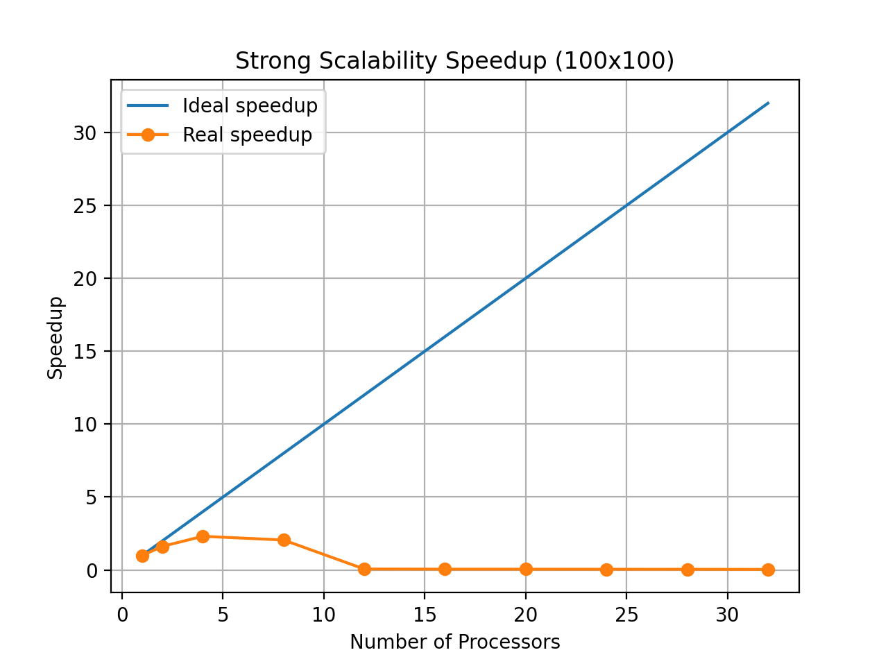 | 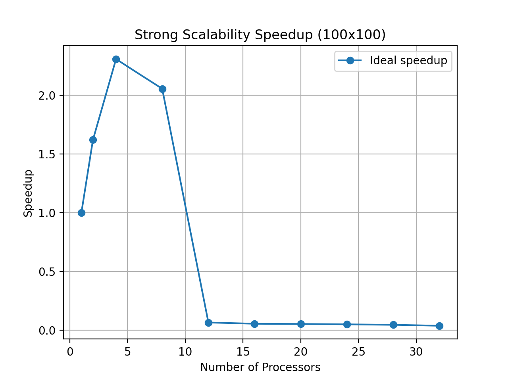 |

|                            1000x1000                             |                                 1000x1000 (zoom)                                 |
| :--------------------------------------------------------------: | :------------------------------------------------------------------------------: |
|  | 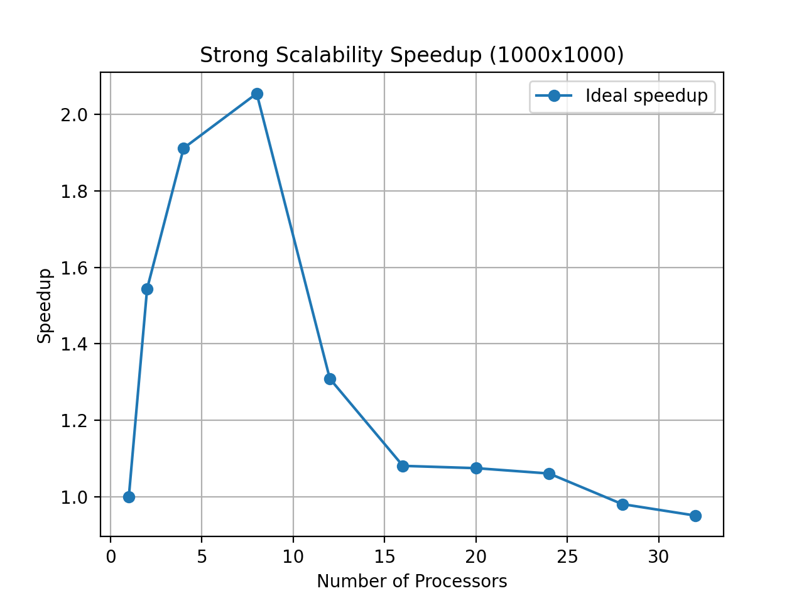 |

|                            2500x2500                             |                                 2500x2500 (zoom)                                 |
| :--------------------------------------------------------------: | :------------------------------------------------------------------------------: |
| 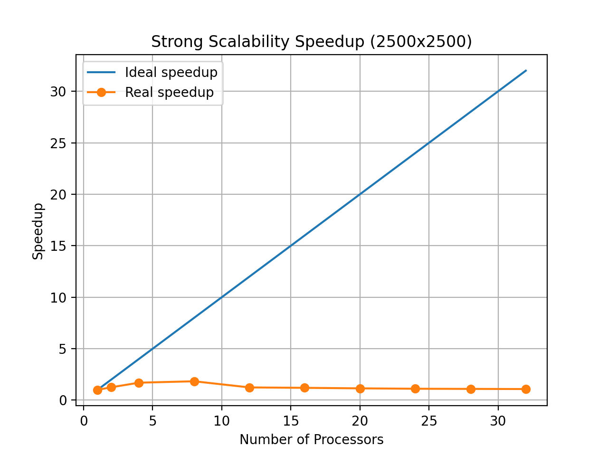 | 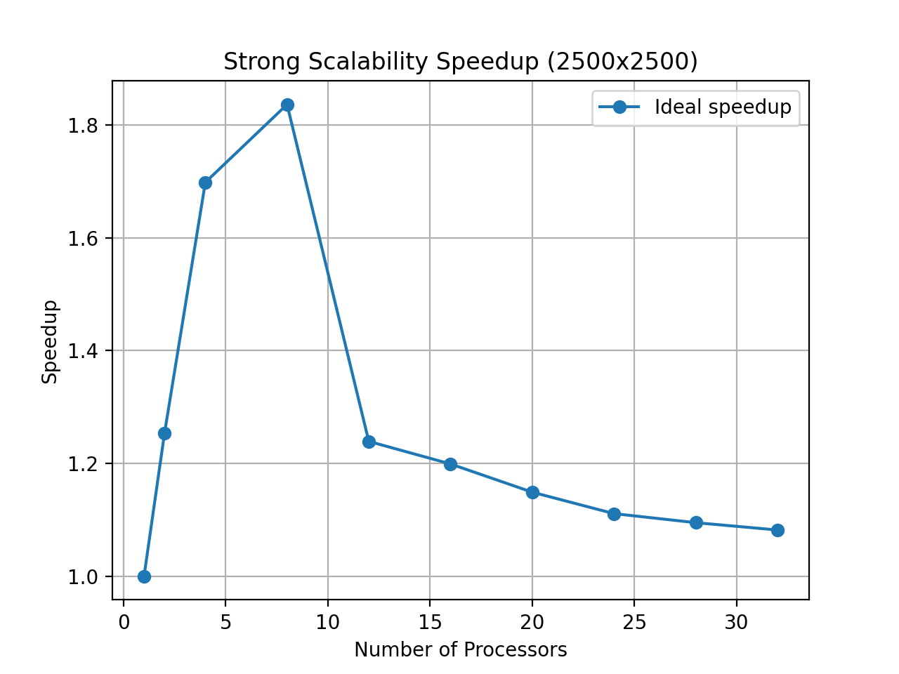 |

|                            5000x5000                             |                                 5000x5000 (zoom)                                 |
| :--------------------------------------------------------------: | :------------------------------------------------------------------------------: |
| 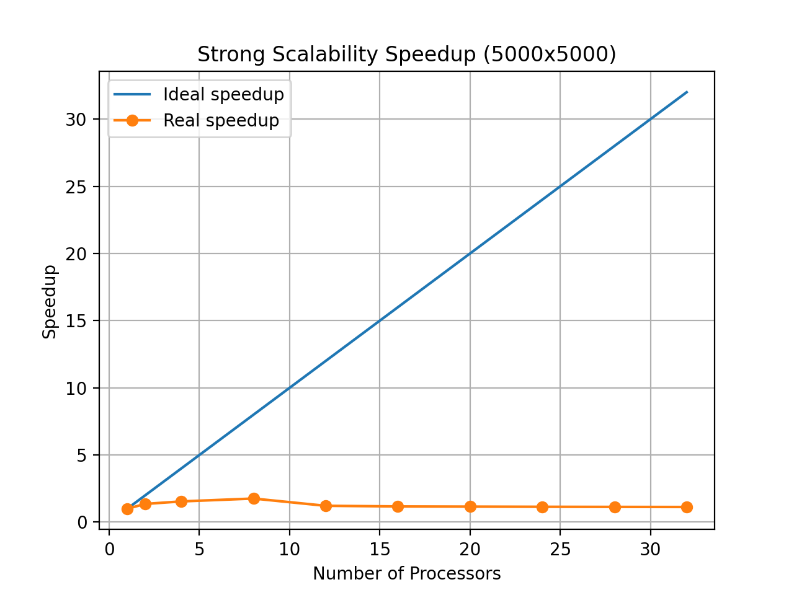 | 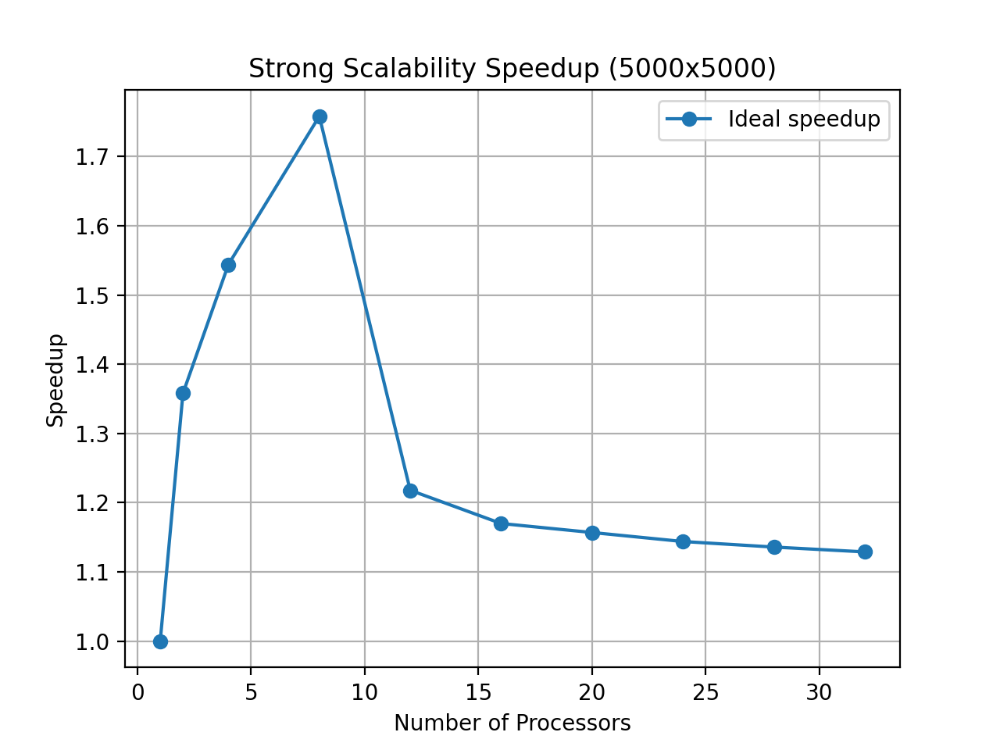 |

|                         Weak Speedup                         |
| :----------------------------------------------------------: |
| 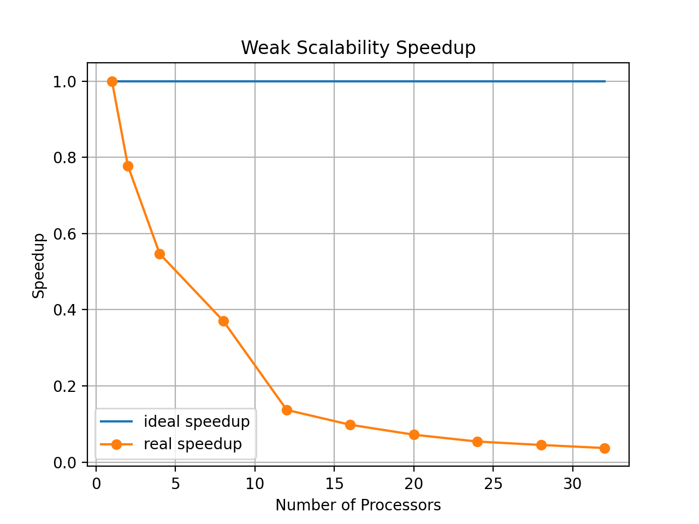 |

I risultati mostrano come la speedup aumenta quando il calcolo parallelo viene effettuato sulla stessa macchina ma diminuisce quando si passa su molteplici macchine. Questa caratteristica è dovuta al fatto che la comunicazione tra i vari processi situati su macchine diverse è molto dispendiosa in termini di tempo mentre quella che avviene all'interno della stessa macchina è molto più veloce. Per come è stata implementata la soluzione e per come si può osservare dai grafici precedenti, l'algoritmo lavora molto bene in locale con 8 processi (pari al numero massimo di vCPUs per una singola istanza t2.2xlarge).

Il trend è più o meno sempre lo stesso, ovvero che la speedup aumenta finchè si utilizzano al massimo tutti i core della stessa macchina, mentre diminuisce quando si passa al calcolo distribuito.

### Scalabilità forte

<!-- |                           100x100                           |                            1000x1000                            |
| :---------------------------------------------------------: | :-------------------------------------------------------------: |
| 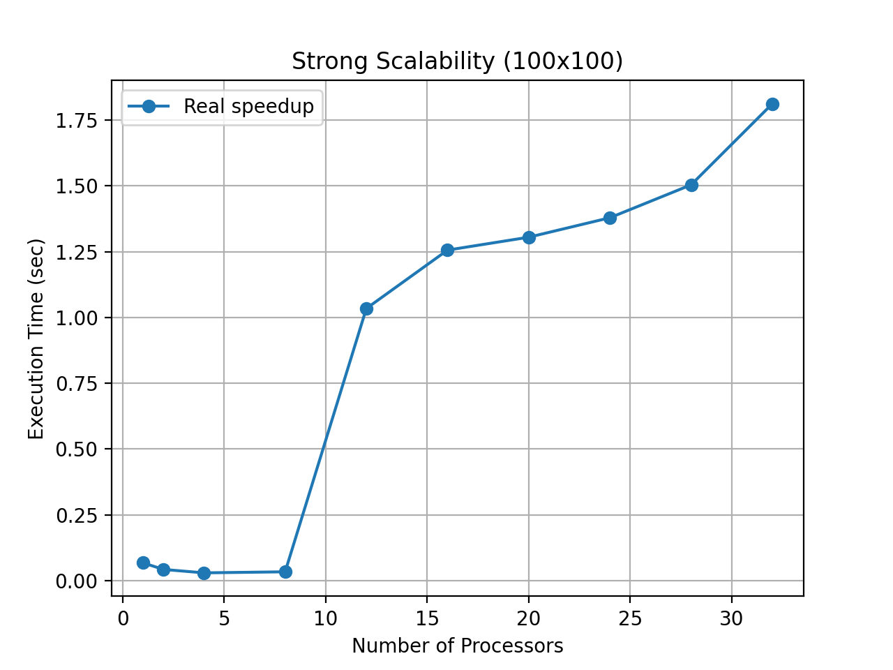 | 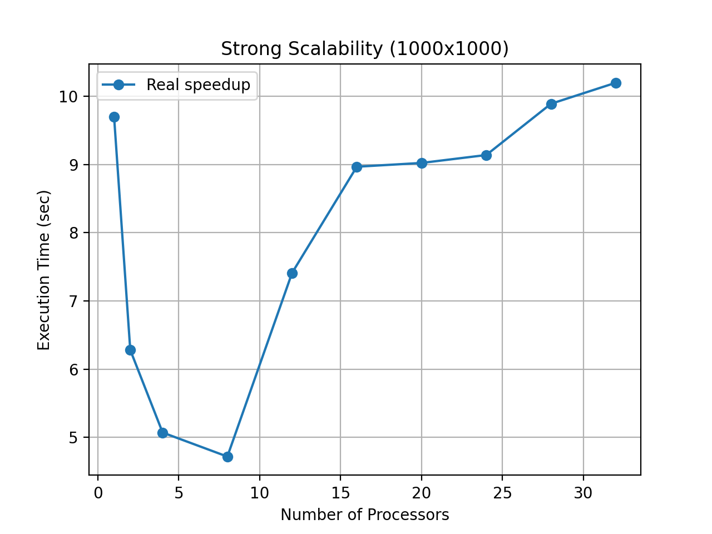 |

|                            2500x2500                            |                            5000x5000                            |
| :-------------------------------------------------------------: | :-------------------------------------------------------------: |
| 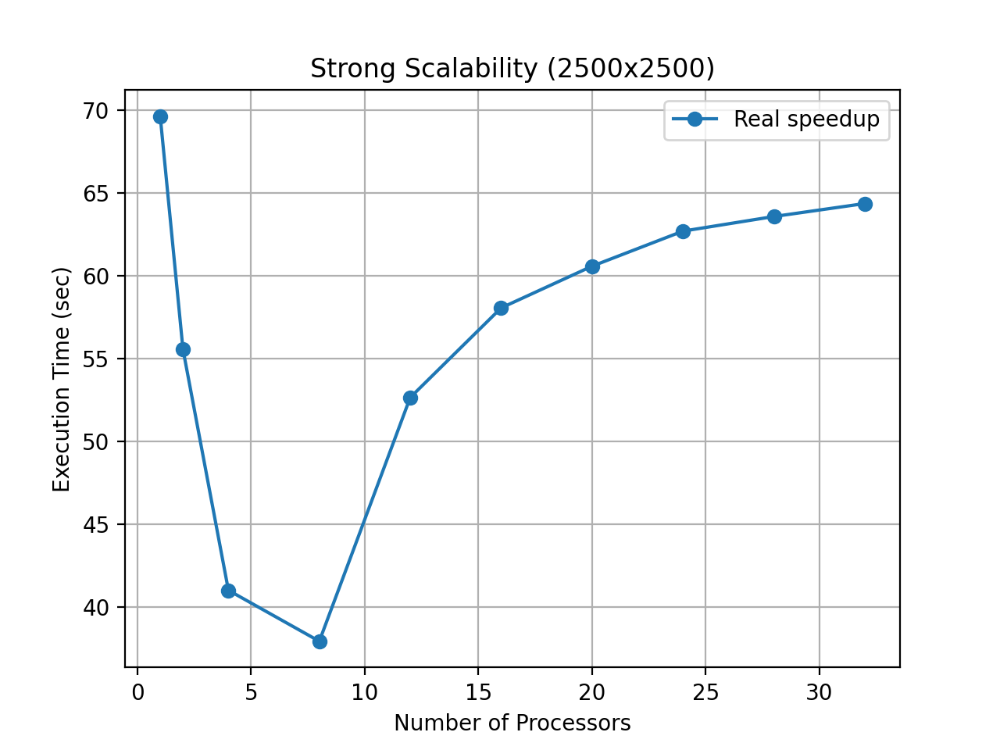 | 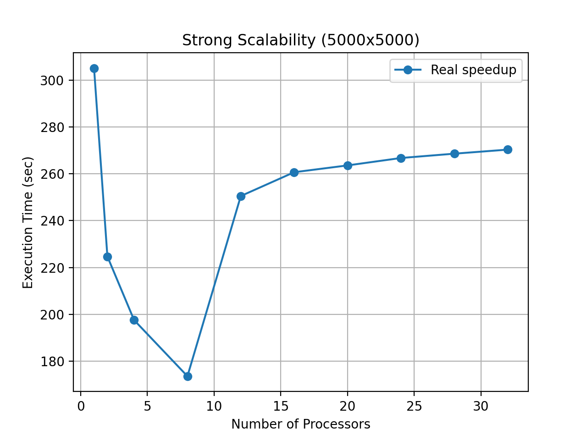 | -->

### Scalabilità debole

<!-- 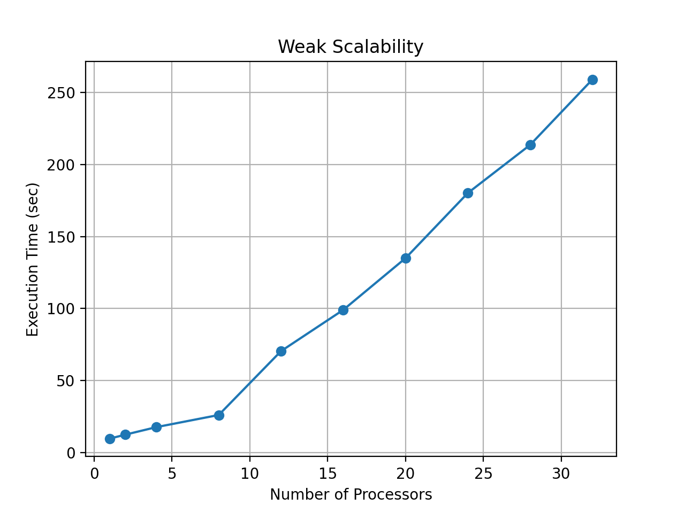 -->
